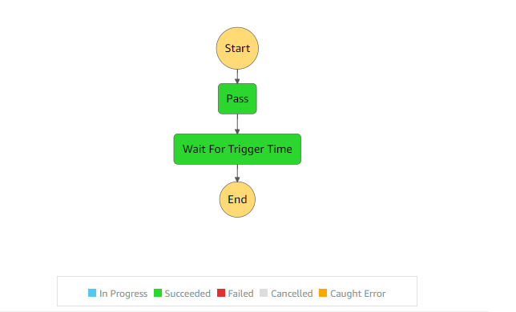
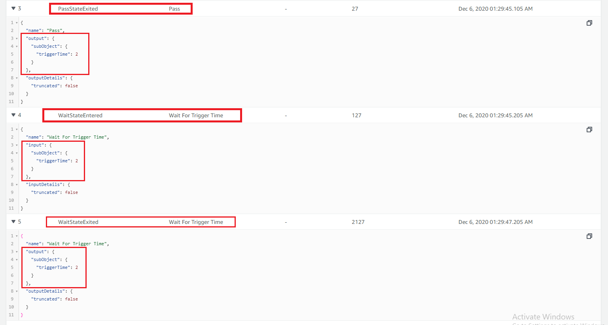

# Overview of concepts

This project implements a step function that executes 1 pass state and 1 wait state in the sequence shown below

>State-machine flow diagram:

>  

## Pass state

The first step here is a Pass state. Unlike lambda functions, a Pass state passes its input to its output, without performing work. However, you can inject some new data in the state and filter the input. Pass states are useful when constructing and debugging state machines. In this example the pass state passes its inputs to the output and also adds some new data. 

## Wait state

The second state includes a Wait state. A Wait state waits for a given number of seconds, or until the current time hits a particular time. The time to wait may be taken from the execution's JSON state. In this example, the Wait state waits for a certain number of seconds and that number comes from the previous "Pass" state.

The image below shows that the Pass state injects a key named "subOject" in its output that defines a key-value pair for the "triggerTime". This gets passed as an input to the next state which is our "Wait" state. This Wait state then waits for the number of seconds equal to the value of "triggerTime" before giving its output.

>State-machine passing states:

>  

note: To test your step function go to the step-functions console and start the execution for your step function.For this example, you can enter anything in the starting input state as we are not utilizing it in our step function. However in a real-world application the initial starting state would mostly come from the event-bridge in the form of an event.

# Code explanation

## step 1

We Pass and Wait states.

```javascript
 // Pass does not do any processing. It only takes the input (or filters input) and can add some more data to the state
    // In this case it adds { ..., "subObject": { "triggerTime": 2 } } to the current JSON state
    
    const pass = new stepFunctions.Pass(this, "Pass", {
      result: stepFunctions.Result.fromObject({ triggerTime: 2 }),
      resultPath: "$.subObject",
    });

    // Wait does not do anything except for waiting for the defined time and then passing the input state to the output.
    // In this case we are waiting for 2 seconds. The value '2' is coming from the previous state {subObject:{"triggerTime": 2}}

    const wait = new stepFunctions.Wait(this, "Wait For Trigger Time", {
      time: stepFunctions.WaitTime.secondsPath("$.subObject.triggerTime"),
    });
```


## step 2

Then we created a chain for the step function. Chain defines the sequence of execution. In this example the chain executes "Pass" state before the "Wait" state.

```javascript
// creating chain to define the sequence of execution

    const chain = stepFunctions.Chain.start(pass).next(wait);
```

## step 3

Then we created our step function or our state machine and referenced our chain in it.

```javascript
// create a state machine

    new stepFunctions.StateMachine(this, "state_machine_pass_wait", {
      definition: chain,
    });
```

